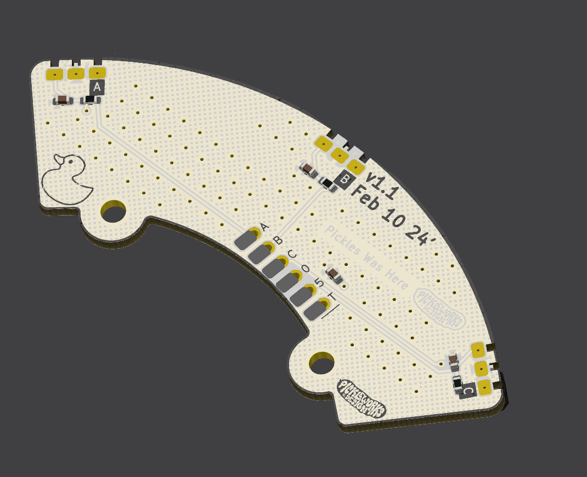
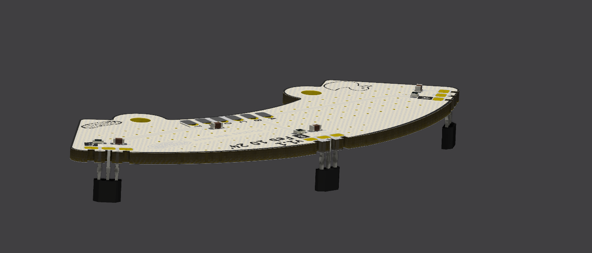

# Hall-Sensor-Board

This board is for anyone who has a motor with a busted hall sensor board that needs fixing

Manufacturing has been set up for JLCPCB assembly service

Required files are included in the production folder

jlcpcb
gerber -> hall_sensor_board.zip

materials -> bom.csv

placement -> positions.csv